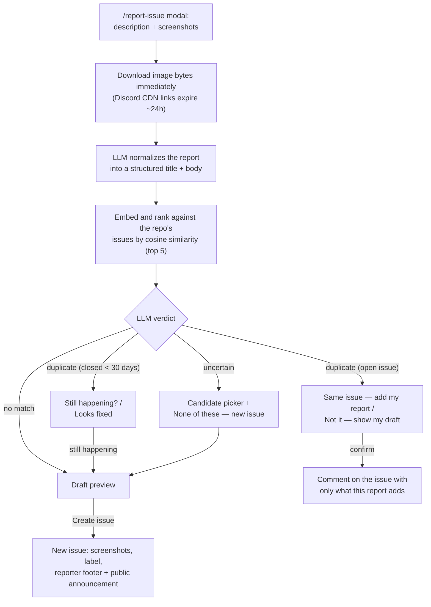

# Discord → GitHub Issue Bot

[](https://github.com/Msgaihede/gh-issue-bot/actions/workflows/ci.yml)
[](https://github.com/Msgaihede/gh-issue-bot/actions/workflows/release.yml)
[](https://dotnet.microsoft.com/)

A Discord bot that turns short bug reports and feature requests into
well-written, **deduplicated** GitHub issues — without the reporter ever
needing a GitHub account.

Members of your Discord server run a slash command, describe the problem, and
attach screenshots. An LLM rewrites the report into a structured issue,
semantic search checks it against the repository's existing issues, and the
reporter confirms before anything touches GitHub: a new issue, or a comment on
the matching one that carries only what the new report adds.

## Features

- **Slash-command reporting** — `/report-issue` and `/request-feature` open a
  modal with a description field and up to 10 screenshots.
- **AI normalization** — raw text becomes a structured draft (bug or feature
  template), translated into English if needed. The model never invents facts
  that were not in the report.
- **Semantic duplicate detection** — reports are embedded
  (`text-embedding-3-small`) and ranked against an incrementally synced copy of
  the repo's issues by cosine similarity; an LLM verdict then decides between
  *duplicate*, *uncertain* (reporter picks from candidates), and *no match*.
- **Human in the loop** — nothing reaches GitHub without an explicit click.
  Every interaction stays ephemeral until an issue is actually created.
- **Smart duplicate comments** — confirming a duplicate posts a comment with
  only what the new report adds (different repro steps, versions, error
  messages), not a repeat of the issue.
- **Regression flow** — a match on a recently closed issue asks "still
  happening?" and files a new issue referencing the old one.
- **Screenshots that survive** — Discord CDN links expire in ~24 h, so image
  bytes are downloaded at submit time and uploaded to GitHub when the issue is
  created (with a Contents-API fallback branch if the primary upload endpoint
  refuses).
- **Multi-app** — one bot instance serves any number of repositories, each
  mapped to its own Discord guilds and announcement channels, each with its own
  credentials.
- **PAT or GitHub App auth** — per app; GitHub App credentials make issues
  authored by `<app-name>[bot]` instead of a personal account.

## How a report becomes an issue



Drafts wait in SQLite for one hour between the modal and the confirming click;
the click claims the draft atomically, so a double-click can never file the
same report twice.

## Slash commands

| Command | What it does |
| --- | --- |
| `/report-issue [app]` | Bug-report modal → deduplicated issue with the `bug` label |
| `/request-feature [app]` | Same flow with the feature template and the `enhancement` label |
| `/issues [app]` | Ephemeral list of the repo's open issues with links (capped at 25) |

The `app` option is only needed when a guild maps to more than one configured
app.

## Getting started

### Prerequisites

- [.NET 10 SDK](https://dotnet.microsoft.com/download) (or Docker)
- A Discord bot token ([Discord Developer Portal](https://discord.com/developers/applications))
- An OpenAI API key (chat + embeddings)
- GitHub credentials per repository: a personal access token **or** a GitHub
  App installation (see below)

### Configure

Configuration comes from `appsettings.json`, environment variables (`__` as
the nesting delimiter), command-line arguments, and Docker secrets — later
sources win. The minimal shape:

```json
{
  "Discord": { "Token": "<secret>" },
  "OpenAI": {
    "ApiKey": "<secret>",
    "ChatModel": "gpt-5.6-luna",
    "EmbeddingModel": "text-embedding-3-small"
  },
  "Apps": [
    {
      "Name": "MyApp",
      "Repo": "owner/repo",
      "GitHubToken": "<secret>",
      "GuildIds": [111111111111111111],
      "ChannelIds": [222222222222222222]
    }
  ]
}
```

`.env.example` documents the environment-variable form of every knob.
Configuration is validated at startup: any problem is printed as a
`CONFIG ERROR: …` line and the bot exits before connecting to anything.

### Run

```sh
dotnet run --project src/DiscordGithubBot
```

`appsettings.json` ships secret-free, so supply the Discord token, OpenAI key,
and GitHub credentials via environment variables (the app does not read `.env`
itself — export the values, or use a tool that loads `.env` files).

### Run with Docker

```sh
docker compose up --build
```

The image runs as a non-root user and stores the SQLite database on the named
`botdata` volume. Secrets come from a `.env` file, Docker secrets under
`secrets/` (key-per-file, they override everything), or both — see
[APP.md](APP.md#running-in-docker) for the details and one important caveat
about `Database__Path`.

Pushes to `main` publish the image to
`ghcr.io/msgaihede/gh-issue-bot` (tags `latest` and `sha-<commit>`).

## GitHub credentials: PAT or GitHub App

Each configured app authenticates with **exactly one** of:

- **`GitHubToken`** — a personal access token; issues are authored by the
  token's owner.
- **`GitHubApp`** — an `AppId` + `InstallationId` + private key; issues are
  authored by `<app-name>[bot]`. The App needs **Issues: Read and write** and
  **Contents: Read and write** (screenshot fallback), and nothing else.

[APP.md](APP.md#github-credentials-pat-or-github-app) walks through creating
the App and explains the one sharp edge (PEM private keys cannot be inlined
into environment variables — use `PrivateKeyPath` or a Docker secret file).

To verify screenshot uploads against a real repository without going through
Discord:

```sh
dotnet run --project src/DiscordGithubBot -- --smoke-upload owner/repo
```

It prints the auth mode in use and `SMOKE OK: <url>` on success.

## Development

```sh
dotnet build   # build everything
dotnet test    # run the XUnit suite
```

Logic lives in testable services (`Pipeline`, `Ai`, `GitHub`, `Data`); the
Discord layer stays thin. CI runs build + tests on every PR and push to
`main`; the release workflow additionally builds and pushes the Docker image
when tests pass.

## Documentation

- [APP.md](APP.md) — full description of the app: workflow details,
  configuration reference, Docker setup, manual verification checklist.
- [docs/DECISIONS.md](docs/DECISIONS.md) — every non-obvious decision, dated
  and explained.
- [Design document](docs/superpowers/specs/2026-08-18-discord-github-issue-bot-design.md)
  — the original design rationale.
