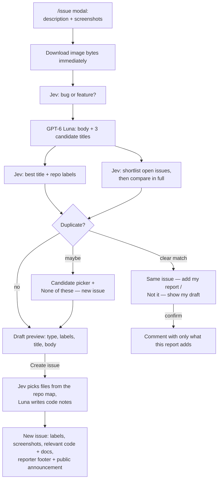

# Discord → GitHub Issue Bot

[](https://github.com/Msgaihede/gh-issue-bot/actions/workflows/ci.yml)
[](https://github.com/Msgaihede/gh-issue-bot/actions/workflows/release.yml)
[](https://dotnet.microsoft.com/)

A Discord bot that turns short bug reports and feature requests into
well-written, **deduplicated**, **labelled** GitHub issues that point at the
relevant code — without the reporter ever needing a GitHub account.

Anyone runs `/issue`, describes the problem, and attaches screenshots. A
decision model (TypeSafe's **Jev**) decides whether it is a bug or a feature,
GPT-6 Luna writes the issue, Jev reads the repository's open issues to catch
duplicates and picks the repository's own labels, and the reporter confirms
before anything touches GitHub. Created issues list the source files and docs
they are most likely about. Every model call goes through
[OpenRouter](https://openrouter.ai/).

## Features

- **One command, user-installable** — `/issue` opens a modal (description +
  up to 10 screenshots). The bot can be added to a server or to a user's own
  Discord account (`/issue-install` hands out the link), so it works in any
  server, DM or group chat — outside a configured server, for the apps of the
  configured servers you are a member of.
- **Jev decides** — bug vs feature, which of three drafted titles best
  describes the issue, which of the repository's labels apply, which open
  issue (if any) it duplicates, and which files it is about. Decisions come
  back as probabilities that code gates on, not as parsed text.
- **Duplicate detection that reads the issues** — every open issue's title and
  opening go past Jev; the likeliest few are then compared with the report in
  full. A clear match offers "add my report", a maybe asks the reporter.
- **The repository's own labels** — every label that fits, minus triage labels
  such as `duplicate` or `wontfix`.
- **Code and docs context** — a background repository map (one summary per
  source file and Markdown doc, refreshed incrementally) lets the bot name the
  relevant files and explain how they relate — written into the GitHub issue
  only, never shown in Discord.
- **Cheap by design** — GPT-6 Luna on OpenAI's flex tier with automatic
  fallback to the regular tier, Jev for everything that is a decision, code
  context only for issues that are actually created: ≈ $0.004 per report,
  so 1000 reports a month stay under $5 (see [APP.md](APP.md#cost)).
- **Human in the loop** — nothing reaches GitHub without an explicit click;
  every interaction stays ephemeral until an issue is created.
- **Smart duplicate comments** — confirming a duplicate posts only what the new
  report adds.
- **Screenshots that survive** — image bytes are downloaded at submit time
  (Discord CDN links expire) and uploaded to GitHub on creation.
- **Multi-app, PAT or GitHub App auth** — one instance serves many
  repositories, each with its own credentials and announcement channels.

## How a report becomes an issue


```mermaid
flowchart TD
    A["/issue modal:<br>description + screenshots"] --> B["Download image bytes immediately"]
    B --> C["Jev: bug or feature?"]
    C --> D["GPT-6 Luna: body + 3 candidate titles"]
    D --> E["Jev: best title + repo labels"]
    D --> F["Jev: shortlist open issues,<br>then compare in full"]
    E --> G{Duplicate?}
    F --> G
    G -->|clear match| H["Same issue — add my report /<br>Not it — show my draft"]
    G -->|maybe| I["Candidate picker +<br>None of these — new issue"]
    G -->|no| J["Draft preview: type, labels, title, body"]
    H -->|confirm| K["Comment with only what this report adds"]
    I --> J
    J -->|Create issue| L["Jev picks files from the repo map,<br>Luna writes code notes"]
    L --> M["New issue: labels, screenshots, relevant code + docs,<br>reporter footer + public announcement"]
```

## Slash commands

| Command | What it does |
| --- | --- |
| `/issue` | Report a bug or request a feature → deduplicated, labelled issue |
| `/issue-install` | Link to add the bot to your own Discord account |
| `/list-issues [app]` | Ephemeral list of the repo's open issues with links (capped at 25) |

## Getting started

### Prerequisites

- [.NET 10 SDK](https://dotnet.microsoft.com/download) (or Docker)
- A Discord application with a bot token, and **User Install** enabled under
  *Installation* in the [Developer Portal](https://discord.com/developers/applications)
- An [OpenRouter API key](https://openrouter.ai/keys) — put a monthly credit
  limit on it, or, if your provider keys are BYOK behind OpenRouter, set the
  budget limits on the OpenAI and TypeSafe accounts instead
- GitHub credentials per repository: a personal access token **or** a GitHub
  App installation

### Configure

Configuration comes from `appsettings.json`, environment variables (`__` as
the nesting delimiter), command-line arguments, and Docker secrets — later
sources win. The minimal shape:

```json
{
  "Discord": { "Token": "<secret>" },
  "OpenRouter": { "ApiKey": "<secret>" },
  "Apps": [
    {
      "Name": "MyApp",
      "Repo": "owner/repo",
      "GitHubToken": "<secret>",
      "GuildIds": [111111111111111111],
      "ChannelIds": [222222222222222222]
    }
  ]
}
```

Models default to `openai/gpt-6-luna` and `typesafe/jev-1.13`. `.env.example`
documents the environment-variable form of every knob. Configuration is
validated at startup: any problem is printed as a `CONFIG ERROR: …` line and
the bot exits before connecting to anything.

### Run

Copy `.env.example` to `.env`, fill it in, then:

```sh
./run.ps1
```

(`run.ps1` loads `.env` — the app itself does not read it — and passes its
arguments through; `dotnet run --project src/DiscordGithubBot` works when the
settings are already in your environment.)

To see what the models decide about a report without touching Discord or
GitHub issues — the way to tune the decision thresholds:

```sh
./run.ps1 --dry-run owner/repo "The save button does nothing after I rotate the phone"
```

### Run with Docker

```sh
docker compose up --build
```

The image runs as a non-root user and stores the SQLite database on the named
`botdata` volume. Secrets come from a `.env` file, Docker secrets under
`secrets/` (key-per-file, they override everything), or both — see
[APP.md](APP.md#running-in-docker).

Pushes to `main` publish the image to
`ghcr.io/msgaihede/gh-issue-bot` (tags `latest` and `sha-<commit>`).

## GitHub credentials: PAT or GitHub App

Each configured app authenticates with **exactly one** of:

- **`GitHubToken`** — a personal access token; issues are authored by the
  token's owner.
- **`GitHubApp`** — an `AppId` + `InstallationId` + private key; issues are
  authored by `<app-name>[bot]`. The App needs **Issues: Read and write** and
  **Contents: Read and write** (code reading for the repository map, and the
  screenshot fallback branch).

[APP.md](APP.md#github-credentials-pat-or-github-app) walks through creating
the App. `--smoke-upload owner/repo` verifies screenshot uploads against a real
repository.

## Development

```sh
dotnet build   # build everything
dotnet test    # run the XUnit suite
```

Logic lives in testable services (`Ai`, `CodeContext`, `OpenRouter`,
`Pipeline`, `GitHub`, `Data`); the Discord layer stays thin.

## Documentation

- [APP.md](APP.md) — the full description: workflow, models and cost,
  configuration, user install, Docker, manual verification.
- [docs/DECISIONS.md](docs/DECISIONS.md) — every non-obvious decision, dated
  and explained.
- [Redesign spec](docs/superpowers/specs/2026-09-29-openrouter-jev-redesign.md)
  — OpenRouter, Jev, dedup, labels, code context and the budget.
- [Original design](docs/superpowers/specs/2026-08-18-discord-github-issue-bot-design.md).
